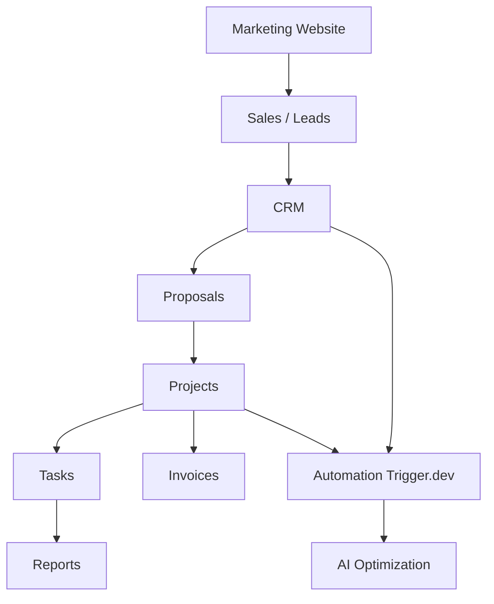
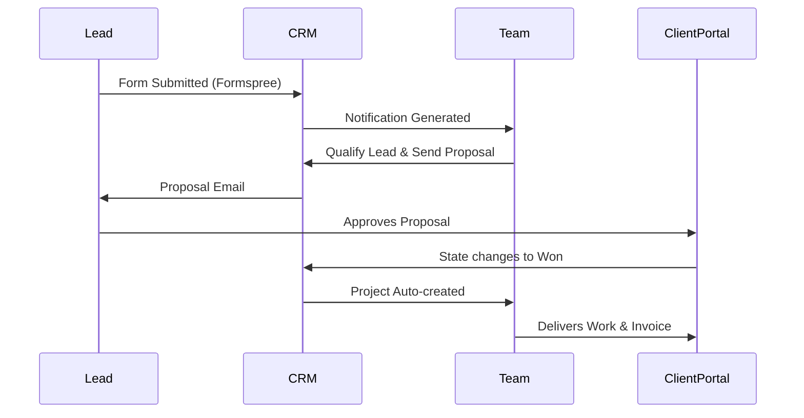

# Aarotech Project Handoff Document

> **Last Updated**: July 2026
> **Purpose**: Single source of truth for the Aarotech web application and Agency Operating System. This document contains all necessary context for a new developer or AI agent to continue development seamlessly.

---

## 1. Project Overview

### Project Vision
Aarotech is building a unified "Agency Operating System" alongside a modern, high-converting marketing website. It is designed to act as the central hub for the agency—starting from lead acquisition on the marketing site, flowing into a CRM, moving to project management, and ending with client delivery and invoicing.

### Business Goals
1. **Acquire**: Generate leads through a highly optimized, fast, and SEO-friendly marketing website.
2. **Convert**: Funnel leads into an internal CRM for tracking and proposal generation.
3. **Fulfill**: Manage projects, tasks, and communications securely through a Client Portal.
4. **Scale**: Automate repetitive tasks using Trigger.dev and AI tools.

### Target Audience
- **External**: Prospective businesses needing tech solutions, custom software, and digital marketing.
- **Internal**: Aarotech founders, employees, and existing clients (via the Client Portal).

### Current Project Status
The marketing website structure is largely complete, utilizing Next.js 16 App Router, Tailwind CSS v4, and shadcn/ui. Core SEO and metadata configurations are in place. The foundation for the Agency OS (admin and client routes) has been initialized but awaits full feature implementation.

### Long-term Vision
To evolve from a simple digital agency website into a fully automated SaaS-like platform where Aarotech operates its entire business efficiently, eventually incorporating AI for intelligent workflows.

---

## 2. Current Website Status

### Completed Elements
- **Pages**: Home, Services (dynamic), Industries (dynamic), Locations (dynamic), Portfolio (dynamic), Blog (dynamic), Privacy Policy, Terms of Service.
- **Features Implemented**: 
  - Dynamic routing for scalable content.
  - Complete SEO setup (Sitemap, Robots.txt, OpenGraph metadata).
  - WhatsApp chat integration.
  - Formspree integration for contact forms.
- **Optimizations**: 
  - Fully responsive mobile design.
  - Accessibility (ARIA labels, semantic HTML).
  - High-performance UI utilizing server components.

### Intentionally Empty (Pending Production Data)
To avoid polluting the site with "lorem ipsum" or fake data, the following sections exist structurally but lack content:
- Client Testimonials and Reviews.
- Real Portfolio Case Studies.
- Team/Founder bios and images.

---

## 3. Folder Structure

The project follows a standard Next.js App Router architecture:

* `src/app`: The core routing directory.
  * `(admin)`: Route group for internal employee/founder dashboards.
  * `(client)`: Route group for the external client portal.
  * `api`: Next.js backend API routes.
  * `services`, `industries`, `locations`, `portfolio`, `blog`: Marketing pages with dynamic routing.
* `src/components`: Reusable UI components. Primarily contains shadcn/ui components and custom layout sections (navbar, footer, hero).
* `src/data`: Static JSON/TypeScript data arrays used to populate marketing pages until a CMS is integrated.
* `src/db`: Database configurations, Drizzle ORM schema definitions, and migration files.
* `src/lib`: Utility functions (e.g., `cn` for Tailwind class merging), authentication wrappers, and shared helpers.

---

## 4. Tech Stack

| Technology | Purpose | Current/Future Usage | Cost Status |
| :--- | :--- | :--- | :--- |
| **Next.js (v16)** | Core Framework | Server Components, Routing, API | Free (OSS) |
| **TypeScript** | Type Safety | Enforces strict typing across the app | Free |
| **Tailwind CSS (v4)** | Styling | Rapid UI development via utility classes | Free |
| **shadcn/ui** | UI Components | Accessible, customizable base components | Free |
| **Clerk** | Authentication | B2B Organization Auth and user management | Free Tier |
| **Neon (PostgreSQL)**| Database | Serverless relational data storage | Free Tier |
| **Drizzle ORM** | Database ORM | Type-safe SQL schema and query builder | Free |
| **Formspree** | Form Handling | Capturing leads from marketing site | Free Tier |
| **Vercel** | Hosting | Edge deployment, CI/CD | Free Tier |

*Future Integrations:* **Trigger.dev** (Background jobs), **Resend** (Emails), **Cloudflare R2** (Asset storage), **Zustand** (Client state), **React Query** (Data fetching).

---

## 5. System Architecture

**Flow:** A lead comes through the marketing site, automatically enters the Sales CRM. Once won, it converts into a Project. The Project generates Tasks and Invoices. The entire lifecycle is monitored by Automations and future AI systems.

---

## 6. Domain Architecture

- **`aarotech.in`**: The main marketing website. Built for speed, SEO, and conversions.
- **`app.aarotech.in`**: The Client Portal. Where clients log in to view project progress, approve proposals, and pay invoices.
- **`admin.aarotech.in`**: The internal Agency OS. Where employees and founders manage the business.

**Routing Philosophy**: Next.js route groups `(admin)` and `(client)` are used to separate concerns while keeping the codebase unified. Middleware intercepts requests to protect routes based on Clerk authentication state and RBAC roles.

---

## 7. Database Architecture

The database utilizes PostgreSQL (Neon) with Drizzle ORM.

**Core Concept:** The `Organizations` table is the central entity. Everything (Projects, Users, Invoices) belongs to an Organization.

**Planned Tables:**
1. **Users**: Clerk ID, Email, Role, OrganizationID.
2. **Organizations**: Name, Type (Internal vs Client), Billing Details.
3. **Leads**: Name, Company, Email, Status, Source.
4. **Projects**: Title, Status, OrgID, Timeline.
5. **Tasks**: Title, ProjectID, AssigneeID, Status.
6. **Invoices**: Amount, Status, ProjectID, DueDate.
7. **Proposals**: Content, Status, LeadID.

*Indexes will be placed on foreign keys (OrgID, ProjectID) and frequently queried fields (Email, Status) for scalability.*

---

## 8. Module Architecture

- **Sales CRM**: Tracks leads from Formspree to closed deals.
- **Client Portal**: External-facing dashboard for clients to self-serve.
- **Projects & Tasks**: Kanban and list views for internal fulfillment.
- **Knowledge Base**: Internal SOPs and documentation.
- **Proposal Builder**: Template-based proposal generation.
- **Finance**: Invoicing and payment tracking.
- **Asset Library**: Central storage for client logos, brand guidelines (R2).
- **Automation**: Webhook handlers for external triggers.

---

## 9. Authentication & RBAC

**Why Clerk?** Clerk provides native support for B2B Organizations, making it trivial to isolate client data from one another while allowing internal employees access across organizations.

**Roles:**
- **Founder**: Full system access, financial visibility, admin controls.
- **Admin**: Managerial access, can assign tasks and manage users.
- **Employee**: Can view assigned projects and tasks.
- **Client**: Severely restricted. Can only view data linked to their specific Organization ID.

**Protection Strategy**: Next.js Middleware (`middleware.ts`) verifies the Clerk JWT on every request to `/admin` and `/client`, redirecting unauthorized users to `/sign-in`.

---

## 10. Workflow Documentation

---

## 11. Automation Plan

Powered by **Trigger.dev**:
- **Lead Automation**: Parse incoming Formspree webhooks, enrich data, and insert into the CRM.
- **Proposal Automation**: Generate PDF proposals upon CRM state change.
- **Invoice Reminders**: Cron jobs checking overdue invoices and dispatching emails via Resend.
- **Meeting Reminders**: WhatsApp/Email notifications 24 hours before scheduled syncs.

---

## 12. AI Roadmap

Future integrations (OpenAI/Anthropic APIs):
- **Proposal Generation**: Draft custom proposals based on initial lead notes.
- **Meeting Summaries**: Auto-transcribe and extract action items.
- **Client Health Predictions**: Analyze communication frequency and task delays to flag at-risk clients.
- **SEO Recommendations**: AI analyzing blog drafts for keyword optimization before publishing.

---

## 13. Completed Work

- [x] Next.js 16 App Router Setup
- [x] Tailwind CSS v4 & shadcn/ui Initialization
- [x] Global Layouts (Navbar, Footer, Mobile Menu)
- [x] Dynamic Marketing Pages (Services, Industries, Locations, Portfolio)
- [x] SEO Foundations (Sitemap, Robots, Metadata)
- [x] Third-Party Integrations (Formspree, WhatsApp)

*Status: Ready for business data injection and Backend Phase 1.*

---

## 14. Remaining Tasks

### Critical
1. **Inject Production Data**: Replace placeholders with real founder details, logos, and case studies.
2. **Database Setup**: Initialize Neon DB and push Drizzle schemas for the CRM.
3. **Authentication**: Implement Clerk for `(admin)` and `(client)` route protection.

### High
4. **CRM Dashboard UI**: Build the internal views for lead management.
5. **Formspree Webhook**: Connect the marketing contact form directly to the new database.

### Medium
6. **Project Management Module**: Build task lists and project details pages.
7. **Client Portal UI**: Build the secure view for clients.

### Low
8. **Trigger.dev Setup**: Implement advanced automated email reminders.
9. **AI Integrations**.

---

## 15. Deployment Guide

- **Hosting**: Vercel. Connect the GitHub repository for automatic CI/CD on push to `main`.
- **Database**: Neon Serverless Postgres.
- **Domain & DNS**: Point `aarotech.in` A/CNAME records to Vercel. Vercel automatically provisions SSL.
- **Environment Variables**:
  - `NEXT_PUBLIC_CLERK_PUBLISHABLE_KEY`
  - `CLERK_SECRET_KEY`
  - `DATABASE_URL` (Neon)
  - `FORMSPREE_ENDPOINT`
- **Analytics**: Integrate Google Analytics and Vercel Web Analytics post-launch.
- **Checklist before launch**: Verify all links, test forms, run Lighthouse audit, submit sitemap to Google Search Console.

---

## 16. Business Data Required (From Owner)

To complete the marketing site, we need:
- High-quality Founder photos and LinkedIn URLs.
- Official Business Address, Phone Number, and Business Email.
- Client Logos (SVG or high-res PNG).
- Written Testimonials & Google Reviews.
- Portfolio Screenshots and detailed Case Studies.
- GST Number (for terms and invoicing).
- Social Media Links.

---

## 17. Future Product Roadmap

- **Phase 1: Marketing Launch** (Current) - Live website capturing leads.
- **Phase 2: Auth & DB Core** - Clerk and Neon implemented.
- **Phase 3: Agency OS (CRM)** - Internal lead management operational.
- **Phase 4: Project Delivery** - Task tracking and project boards.
- **Phase 5: Client Portal** - Clients can log in and view status.
- **Phase 6: Finance & Invoicing** - Stripe/Razorpay integration.
- **Phase 7: Automation** - Trigger.dev background jobs.
- **Phase 8: AI Integration** - Smart workflows.

---

## 18. Design System

- **UI Philosophy**: Clean, premium, fast, utilizing glassmorphism and subtle micro-animations (Framer Motion / tw-animate-css).
- **Typography**: Inter (or Next.js default sans) for clean readability.
- **Colors**: Configured in `app/globals.css`. Dark mode support is native via Tailwind and shadcn.
- **Components**: Standardized via `src/components/ui/` (buttons, cards, inputs).

---

## 19. Coding Standards

- **Architecture**: Strictly adhere to the App Router pattern. Use React Server Components by default; only use `"use client"` when interactivity (hooks, state) is required.
- **Mutations**: Use Next.js Server Actions for form submissions and database mutations. Do not build traditional API routes unless strictly necessary for external webhooks.
- **Database**: All queries must pass through Drizzle ORM for type safety.
- **Styling**: Use `tailwind-merge` and `clsx` (via the `cn` utility) for conditional class names.

---

## 20. Technical Debt

- **Temporary Solutions**: Currently, marketing page data (e.g., list of services) is hardcoded in the `src/data/` folder. This is an intentional temporary solution for speed, to be replaced by a database query or headless CMS later.
- **Known Limitations**: Without a backend yet, the contact form relies on a third-party (Formspree) instead of direct database insertion.

---

## 21. Cost Analysis

- **Today (Dev Phase)**: $0.
- **At Launch**: $0 (Vercel Free, Neon Free, Clerk Free).
- **After 20 Clients**: Still likely $0 unless database compute hours or Clerk MAUs exceed generous free tiers.
- **After 100 Clients**: May require Vercel Pro ($20/mo) and paid database tiers. Domains and professional emails (Google Workspace) are the only immediate external costs.

---

## 22. Next Recommended Steps

**Actionable Execution Roadmap:**
1. **Blocker Resolution**: Meet with the business owner to collect all missing "Business Data" (Section 16).
2. **Data Entry**: Update the hardcoded `src/data/` files with this real business data.
3. **Database Initialization**: Set up Neon DB, write the Drizzle schemas for `Users` and `Organizations`, and run the first migration.
4. **Auth Setup**: Finalize the Clerk integration, specifically configuring the Next.js middleware to secure the `/(admin)` and `/(client)` routes.
5. **Dashboard Scaffolding**: Build the basic layout shell for the Admin CRM.

*End of Document*
