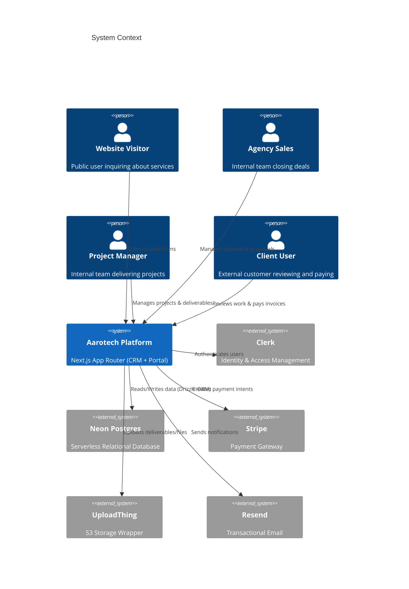
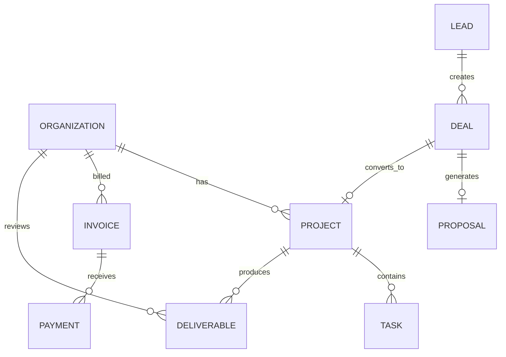

# AAROTECH — ENTERPRISE TECHNICAL DESIGN DOCUMENT (TDD)
**Role:** Chief Software Architect
**Date:** 2026-07-20
**Status:** Approved Master Blueprint

---

## SECTION 1: SYSTEM OVERVIEW

### Vision
To provide a unified, automated, and secure Enterprise CRM and Delivery Portal for a modern digital marketing and development agency, eliminating disconnected tools and ensuring a seamless transition from lead capture to final delivery.

### Goals
- Automate the Lead -> Deal -> Client pipeline securely.
- Provide a world-class Client Portal for approvals and billing.
- Guarantee tenant data isolation natively at the database level.
- Support scaling to hundreds of agency clients with thousands of deliverables.

### Scope
- **In Scope:** Marketing lead capture, CRM pipeline, proposal generation/signing, project and task management, deliverable reviews, invoicing, payments, internal/client notifications.
- **Out of Scope:** Native payroll, general ledger accounting, full HR management, native CMS hosting.

### Guiding Principles
- **Tenant Isolation First:** Security over convenience.
- **Event-Driven Mutations:** Decouple domain side-effects.
- **Single Source of Truth:** No duplicate entities or parallel statuses.
- **Explicit Constraints:** Database schemas prevent invalid states.

### Success Metrics
- 0 data bleed incidents between organizations.
- < 1 second p95 latency for portal dashboard loads.
- 100% test coverage on Server Actions affecting financial data.

---

## SECTION 2: HIGH LEVEL ARCHITECTURE



### Flow Architecture
- **Request Flow:** Vercel Edge Network -> Next.js Middleware (Clerk auth check) -> React Server Components (Read) / Server Actions (Write) -> Drizzle ORM -> Neon Postgres.
- **Tenant Isolation Flow:** The middleware extracts the authenticated `userId`. Server layout resolves `userId` to `organizationId`. Every subsequent repository call explicitly passes `organizationId` as a WHERE clause.
- **Event Flow:** Server Actions mutate DB -> Emit Domain Event to an internal queue -> Queue workers execute side-effects (e.g., sending emails) outside the critical path.

---

## SECTION 3: COMPLETE DOMAIN MODEL

### Entities
1. **Lead**: 
   - *Purpose*: Unqualified inquiry. 
   - *Owner*: Sales. 
   - *Lifecycle*: New -> Contacted -> Qualified.
2. **Deal**: 
   - *Purpose*: Pipeline opportunity. 
   - *Owner*: Sales. 
   - *Lifecycle*: Discovery -> Proposal -> Won/Lost.
3. **Proposal**: 
   - *Purpose*: SOW and Contract. 
   - *Owner*: Sales. 
   - *Relationships*: Belongs to Deal.
4. **Organization**: 
   - *Purpose*: Root tenant. 
   - *Owner*: System. 
   - *Lifecycle*: Active -> Inactive.
5. **Project**: 
   - *Purpose*: Delivery container. 
   - *Owner*: Delivery. 
   - *Lifecycle*: Pending Deposit -> Active -> Completed.
6. **Task**: 
   - *Purpose*: Granular work item. 
   - *Owner*: Delivery. 
   - *Relationships*: Belongs to Project.
7. **Deliverable**: 
   - *Purpose*: Artifact requiring client approval. 
   - *Owner*: Delivery/Client. 
   - *Lifecycle*: Draft -> Review -> Approved.
8. **Invoice**: 
   - *Purpose*: Revenue collection. 
   - *Owner*: Finance. 
   - *Lifecycle*: Draft -> Open -> Paid.
9. **Payment**: 
   - *Purpose*: Ledger entry. 
   - *Owner*: Finance.
10. **ActivityLog**: 
    - *Purpose*: Audit trail. 
    - *Owner*: System.

---

## SECTION 4: DATABASE DESIGN

*Schema Strategy: Neon Postgres via Drizzle ORM.*

### Key Tables
- `organizations`
  - `id` UUID PK
  - `clerk_org_id` VARCHAR UNIQUE NULL
  - `name` VARCHAR NOT NULL
- `deals`
  - `id` UUID PK
  - `lead_id` UUID FK (`leads`)
  - `stage` ENUM ('discovery', 'qualified', 'proposal', 'negotiation', 'won', 'lost')
  - `owner_id` VARCHAR NOT NULL (Clerk User ID)
- `projects`
  - `id` UUID PK
  - `organization_id` UUID FK (`organizations`) NOT NULL
  - `deal_id` UUID FK (`deals`) UNIQUE
  - `status` ENUM ('pending_deposit', 'active', 'completed')
- `deliverables`
  - `id` UUID PK
  - `organization_id` UUID FK (`organizations`) NOT NULL
  - `project_id` UUID FK (`projects`) NULL
  - `retainer_period_id` UUID FK (`retainer_periods`) NULL
  - *Constraint*: `CHECK ( (project_id IS NOT NULL)::int + (retainer_period_id IS NOT NULL)::int = 1 )`
- `invoices`
  - `id` UUID PK
  - `organization_id` UUID FK (`organizations`) NOT NULL
  - `status` ENUM ('draft', 'open', 'processing', 'paid', 'void')
  - `amount_cents` INTEGER NOT NULL

*Note: All client-facing tables contain `organization_id`. Soft deletes use a `deleted_at` timestamp index.*

---

## SECTION 5: ER DIAGRAM



---

## SECTION 6: MODULE ARCHITECTURE

- **CRM**: Owns `Leads`, `Deals`, `Proposals`. *Rule*: Cannot write to `Projects`.
- **Conversion Engine**: Owns the transition logic. *Rule*: Subscribes to `ProposalAccepted` event to instantiate Client entities.
- **Delivery**: Owns `Projects`, `Tasks`, `Deliverables`. *Rule*: Operates strictly under an `organization_id`.
- **Finance**: Owns `Invoices`, `Payments`. *Rule*: Integrates heavily with external gateway (Stripe).
- **Portal**: View layer only. *Rule*: Strictly read/write restricted by Auth token's `organizationId`.

---

## SECTION 7: API & SERVER ACTION SPECIFICATION

*All mutations use Next.js Server Actions wrapped in an error handler.*

- **`acceptProposal(proposalId, signature)`**
  - *Auth*: Verified Email Token or Authenticated Client.
  - *Validation*: Proposal must be `status: 'sent'`.
  - *Side Effect*: Emits `ProposalAcceptedEvent`. Returns success.
- **`submitDeliverable(deliverableId)`**
  - *Auth*: Internal PM only.
  - *DB Transaction*: Update deliverable status -> Insert ActivityLog -> Emit `DeliverableReviewRequestedEvent`.
- **`processPaymentWebhook(payload)`**
  - *Auth*: Stripe Signature Validation.
  - *Idempotency*: Checked via Stripe Event ID in Redis.

---

## SECTION 8: EVENT ARCHITECTURE

- **Pattern**: Transactional Outbox or In-Memory Queue (Trigger.dev).
- **Events**: 
  - `OrganizationCreated` -> Triggers Clerk Org Creation, Client User Invites.
  - `InvoicePaid` -> Triggers Project state `Pending Deposit` -> `Active`.
  - `DeliverableApproved` -> Triggers next project phase unlock, sends internal Slack alert.
- **Retry Strategy**: Exponential backoff. Dead-letter queue for failed webhooks.

---

## SECTION 9: UI ARCHITECTURE

### Admin CRM
- **Pipeline**: Drag and drop Kanban for deals.
- **Proposals**: WYSIWYG editor (TipTap).

### Client Portal
- **Dashboard**: High-level project progress, outstanding invoices, recent deliverables.
- **Deliverables**: Gallery view, detail page with comment thread and explicit "Approve" / "Request Changes" workflow.
- **Billing**: List of invoices, Stripe embedded checkout for "Pay Now".

---

## SECTION 10: COMPONENT LIBRARY & SECTION 11: DESIGN SYSTEM

- **Library**: shadcn/ui + Radix Primitives + Tailwind CSS.
- **Design Tokens**: 
  - Primary: `hsl(var(--primary))`
  - Destructive: `hsl(var(--destructive))`
- **Patterns**: Server Components for data fetching, Client Components isolated only to interactive leaves (e.g., `<KanbanBoard />`, `<SignaturePad />`).

---

## SECTION 12: SEARCH & SECTION 13: NOTIFICATIONS

- **Search**: PostgreSQL full-text search (`tsvector`) on `leads.name`, `organizations.name`, `projects.name`.
- **Notifications**: Resend for email. Templates stored in source control (React Email).

---

## SECTION 14: AUTOMATION ENGINE & SECTION 15: FILES

- **Automation**: Trigger.dev for workflow orchestration (background jobs).
- **Files**: UploadThing. 
  - Structure: `[orgId]/projects/[projectId]/[filename]`
  - Access: Files uploaded via Portal are strictly tied to the `organization_id`.

---

## SECTION 16: SECURITY

- **Authentication**: Clerk.
- **Tenant Isolation**: Every backend query injects `and(eq(table.organizationId, user.orgId))`.
- **IDOR**: Guaranteed prevention by the tenant isolation rule.
- **Secrets**: Managed via Vercel Environment Variables.

---

## SECTION 17: REPORTING & SECTION 18: SETTINGS

- **Reporting**: Aggregation queries on deals (pipeline value), invoices (collected revenue). Cached in Redis for 1 hour.
- **Settings**: Agency-level settings (branding, taxes) stored in a singleton `agency_settings` table.

---

## SECTION 19: TESTING STRATEGY

- **Unit Tests**: Business logic functions (calculating totals).
- **Integration Tests**: Database queries and Server Actions using test DB.
- **E2E Tests**: Playwright scripts for critical paths: Lead -> Deal -> Proposal Sign -> Invoice Pay.

---

## SECTION 20: DEVOPS & SECTION 21: PROJECT STRUCTURE

- **CI/CD**: GitHub Actions -> Vercel.
- **DB Migrations**: Drizzle Kit via CI pipeline before deployment.
- **Structure**:
  ```text
  src/
    app/
      (admin)/crm/...
      (client)/portal/...
    core/
      auth/
      db/ (schema.ts, migrations/)
      actions/
    components/
      ui/ (shadcn)
      shared/
  ```

---

## SECTION 22: ENGINEERING STANDARDS

- **Rule 1**: No direct DB calls from Client Components.
- **Rule 2**: Every Server Action must use `withActionErrorHandling()`.
- **Rule 3**: `requireOrganizationMember()` must be called in every portal route/action.
- **Rule 4**: Use standard Postgres ENUMs, no raw varchar statuses.
