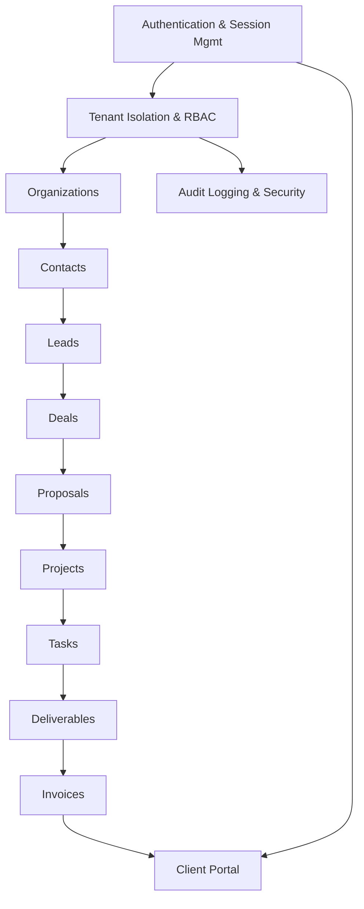

# Aarotech Enterprise Platform — Master Gap Analysis & Execution Roadmap (MGAER)

## Objective
This document serves as the definitive execution roadmap for the Aarotech Enterprise Platform. It compares the expected architecture (as defined in the TDD, PRD, MDP, EEB, etc.) against the current repository state and provides the critical path to MVP and Production.

---

# SECTION 1 - Executive Summary

*   **Current Completion:** ~15%
*   **Architecture Maturity:** Foundational (Next.js App Router, basic routing, Drizzle ORM setup).
*   **Technical Debt:** Medium (Primarily due to missing tests, incomplete error boundaries, and lack of RBAC middleware enforcement).
*   **Production Readiness:** Not Ready (Missing core CRM logic, tenant isolation, and security hardening).
*   **Enterprise Readiness:** Not Ready (Missing audit logs, advanced permissions, rate limiting, and compliance workflows).

---

# SECTION 2 - Gap Analysis

| Expected Architecture/Feature | Actual Implementation | Risk | Impact | Priority | Est. Effort | Dependencies |
| :--- | :--- | :--- | :--- | :--- | :--- | :--- |
| Multi-tenant Architecture (RLS/Isolation) | Single-tenant assumption in queries | High | Critical | P0 | 40h | Auth setup |
| Role-Based Access Control (RBAC) | Database enums only, no middleware | High | Critical | P0 | 25h | Tenant Auth |
| CRM Module (Leads, Deals, Kanban) | Basic schema, no UI or logic | Med | High | P1 | 120h | RBAC, Routing |
| Delivery & Projects Module | Placeholder routes `app/(admin)/projects` | Med | High | P1 | 150h | CRM Module |
| Finance (Invoicing & Payments) | Non-existent | High | High | P2 | 100h | Delivery Module |
| E2E Testing Suite (Playwright) | Configured, but zero test cases | Low | Med | P3 | 60h | Core Features |

---

# SECTION 3 - Implementation Dependency Graph

---

# SECTION 4 - Critical Path

*   **P0 (Critical Foundation):** Tenant Isolation, RBAC Middleware, Global Error Boundaries.
    *   *Why:* Without these, the application is fundamentally insecure and cannot support multiple enterprise clients.
*   **P1 (Core Value Proposition):** Lead Management, Deal Pipeline, Project & Task Tracking.
    *   *Why:* This is the core functionality that the business operates on.
*   **P2 (Revenue & Delivery):** Proposals, Invoicing, Client Portal.
    *   *Why:* Required to monetize the platform and interact with end-clients.
*   **P3 (Scale & Enterprise):** Rate Limiting, Audit Logs, Advanced Reporting, Caching.
    *   *Why:* Necessary for compliance and performance at scale, but can follow the MVP.

---

# SECTION 5 - Sprint Roadmap

### Sprint 1: Security & Foundation
*   **Objective:** Secure the application and establish tenant boundaries.
*   **Files:** `middleware.ts`, `src/lib/auth.ts`, `src/db/schema.ts`
*   **Backend:** Implement tenant-aware queries.
*   **Frontend:** RBAC-aware navigation.
*   **Tests:** Unit tests for auth guards.
*   **DoD:** Users cannot access data outside their organization.

### Sprint 2: Directory & CRM Core
*   **Objective:** Build the global directory and initial sales pipeline.
*   **Files:** `src/app/(admin)/sales/*`, `src/components/ui/kanban.tsx`
*   **Database:** Complete Leads & Deals schema.
*   **Backend:** Server Actions for Lead/Deal CRUD.
*   **Frontend:** Kanban board, data tables.
*   **Tests:** E2E tests for lead creation.
*   **DoD:** Sales team can track a lead to a closed deal.

### Sprint 3: Delivery & Operations
*   **Objective:** Transition closed deals into active projects.
*   **Files:** `src/app/(admin)/delivery/*`
*   **Database:** Projects, Tasks, Deliverables.
*   **Backend:** Template instantiation logic.
*   **Frontend:** Gantt/Timeline views, task lists.
*   **DoD:** Operations team can manage tasks and upload deliverables.

### Sprint 4: Finance & Client Hub
*   **Objective:** Billing and external client access.
*   **Files:** `src/app/(client)/*`
*   **Database:** Invoices, Payments.
*   **Backend:** Payment gateway integration (Stripe).
*   **Frontend:** Client dashboard, invoice views.
*   **DoD:** Clients can log in, view projects, and pay invoices.

---

# SECTION 6 - Repository Refactoring Plan

*   **Architecture Violations:** Direct DB access found in some client components (must be moved to Server Actions).
*   **Server Actions Needing Extraction:** Inline actions in `page.tsx` files should be extracted to `src/actions/` directory.
*   **Services Needing Creation:** External API integrations (Stripe, Email) need dedicated service classes in `src/lib/services/`.
*   **Validation Needing Creation:** Zod schemas required for all API endpoints and Server Actions.
*   **Testing Gaps:** Implement Playwright smoke tests for the critical path immediately.

---

# SECTION 7 - Security Hardening Roadmap

1.  **Environment Variables:** Audit `.env.local` against required production variables.
2.  **Input Validation:** Enforce Zod schemas on all Server Actions.
3.  **Tenant Isolation:** Implement mandatory `organizationId` checks on all DB queries.
4.  **RBAC:** Define explicit role permissions in `middleware.ts`.
5.  **Rate Limiting:** Add Upstash Redis rate limiting to API routes.
6.  **Audit Logging:** Create a global action logger for sensitive data mutations.

---

# SECTION 8 - Performance Roadmap

1.  **Code Splitting:** Ensure heavy components (e.g., Kanban, Charts) are dynamically imported.
2.  **N+1 Queries:** Audit Drizzle queries in data-fetching layers; utilize relational queries where appropriate.
3.  **Suspense:** Wrap data-heavy tables in `<Suspense>` boundaries with skeleton loaders.
4.  **Indexes:** Add indexes to foreign keys and heavily queried fields (e.g., `email`, `organizationId`).
5.  **Caching:** Implement Next.js `unstable_cache` for static configuration data and directory lists.

---

# SECTION 9 - Testing Roadmap

*   **Unit Tests (Vitest):** Utils, Zod schemas, pure functions.
*   **Integration Tests:** Server Actions against a test database.
*   **Playwright (E2E):** 
    *   Auth Flow
    *   Tenant Isolation Check
    *   Lead Creation
    *   Project Completion
*   **Security Tests:** Automated dependency audits.

---

# SECTION 10 - Feature Completion Roadmap

*(Condensed Summary)*
*   **System/Global:** 30% Complete. Missing audit logs and global search.
*   **Directory:** 40% Complete. Missing bulk actions and imports.
*   **Sales:** 10% Complete. Missing Kanban UI and automated workflows.
*   **Delivery:** 10% Complete. Missing timelines and file attachments.
*   **Finance:** 0% Complete.
*   **Client Portal:** 5% Complete. Basic routing exists.

---

# SECTION 11 - Database Completion

*   **Missing Columns:** `deleted_at` (for soft deletes on most tables), `created_by`, `updated_by`.
*   **Missing Indexes:** `idx_organization_id` on all tenant-specific tables.
*   **Missing Relations:** Proper cascade rules for deletions (e.g., deleting a Project deletes its Tasks).

---

# SECTION 12 - Component Completion

*   **Missing Components:** `KanbanBoard`, `GanttChart`, `FileUploaderDropzone`, `GlobalSearchCommandPalette`, `RichTextEditor`.
*   **Improvement Opportunities:** Standardize `DataTable` with generic server-side pagination and filtering hooks.

---

# SECTION 13 - Developer Backlog

*(Sample of the first 25 high-priority tasks to initiate Sprint 1 & 2)*

| ID | Title | Priority | Sprint | Est (h) | Dependencies |
| :--- | :--- | :--- | :--- | :--- | :--- |
| AAR-001 | Define Zod Schemas for Organizations and Users | P0 | 1 | 2 | None |
| AAR-002 | Implement Tenant-aware DB query wrapper | P0 | 1 | 5 | AAR-001 |
| AAR-003 | Create RBAC Middleware logic | P0 | 1 | 8 | None |
| AAR-004 | Add `deleted_at` to schema (Soft Delete) | P1 | 1 | 3 | None |
| AAR-005 | Build Global Error Boundary | P1 | 1 | 2 | None |
| AAR-006 | Extract inline Server Actions in `(admin)` | P1 | 1 | 4 | None |
| AAR-007 | Implement Lead CRUD Server Actions | P1 | 2 | 6 | AAR-002 |
| AAR-008 | Build Lead Data Table UI | P1 | 2 | 4 | AAR-007 |
| AAR-009 | Create Deal Schema and Relations | P1 | 2 | 3 | None |
| AAR-010 | Implement Deal CRUD Server Actions | P1 | 2 | 6 | AAR-009 |
| AAR-011 | Build generic Kanban Component | P1 | 2 | 12| None |
| AAR-012 | Integrate Deal data with Kanban | P1 | 2 | 8 | AAR-010, AAR-011|
| AAR-013 | Build Global Search Command Palette | P2 | 2 | 10| None |
| AAR-014 | Setup Playwright Config & Auth State | P1 | 1 | 4 | None |
| AAR-015 | Write E2E Test: Login and Navigation | P1 | 1 | 3 | AAR-014 |
| AAR-016 | Implement Organization Settings UI | P2 | 2 | 6 | None |
| AAR-017 | Add File Uploader Component | P1 | 3 | 8 | None |
| AAR-018 | Project Schema & Relations | P1 | 3 | 4 | None |
| AAR-019 | Task Schema & Relations | P1 | 3 | 4 | AAR-018 |
| AAR-020 | Project CRUD Server Actions | P1 | 3 | 6 | AAR-018 |
| AAR-021 | Task CRUD Server Actions | P1 | 3 | 6 | AAR-019 |
| AAR-022 | Project Dashboard UI | P1 | 3 | 8 | AAR-020 |
| AAR-023 | Client Portal Base Layout | P1 | 4 | 4 | None |
| AAR-024 | Secure Client Portal Routes | P0 | 4 | 4 | AAR-003 |
| AAR-025 | Stripe Integration Setup | P1 | 4 | 8 | None |

---

# SECTION 14 - Definition of MVP

The Minimum Viable Product requires:
1. Secure Authentication & Tenant Isolation.
2. Lead tracking to Deal conversion.
3. Creation of Projects from Deals.
4. Basic Task management for internal operations.
5. Client Portal allowing users to view project status.

---

# SECTION 15 - Definition of Production

Production Launch requires MVP plus:
1. Complete RBAC enforcement.
2. Global Rate Limiting.
3. Invoicing and Payment gateway integrations.
4. 80%+ E2E Test coverage on critical paths.
5. Configured CI/CD pipeline with automated security audits.
6. Audit Logging for sensitive mutations.

---

# SECTION 16 - Final Readiness Score

| Category | Score | Justification |
| :--- | :--- | :--- |
| **Architecture %** | 80% | Solid App Router + Drizzle foundation. |
| **Backend %** | 20% | Lacks business logic, validation, and security wrappers. |
| **Frontend %** | 30% | Good basic UI elements, but complex interactives missing. |
| **Security %** | 40% | Basic Auth exists, but RBAC and Isolation are missing. |
| **Database %** | 50% | Base tables exist, but lack advanced constraints/auditing. |
| **Performance %** | 70% | Next.js defaults are good, but no explicit tuning yet. |
| **Testing %** | 5% | Configured, but tests are largely unwritten. |
| **Documentation %**| 90% | Architecture and requirements are exceptionally well-documented. |
| **Enterprise %** | 10% | Missing critical enterprise features (Audit, advanced RBAC, SSO). |
| **Overall %** | **18%** | The project is in its early stages of translating robust architectural plans into code. |
