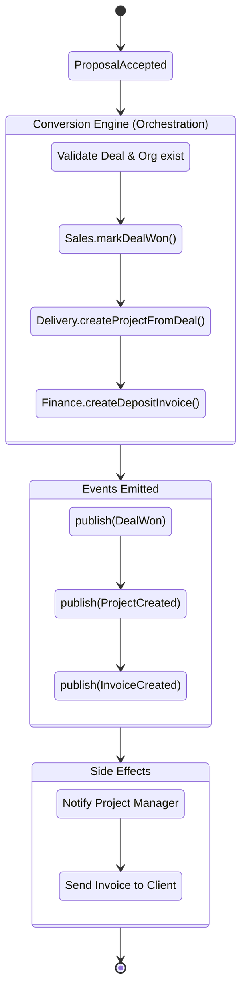

# Conversion Engine Workflow State Diagram

This document defines the canonical workflow contract for orchestrations triggered by bounded contexts.

## Workflow: Commercial Onboarding (Proposal Accepted)

**Trigger:** `ProposalAccepted` Event (Published by Sales)
**Preconditions:** Proposal signature validated. Deal exists and is owned by the Client Organization.
**Orchestrator:** `src/modules/orchestration/conversion-engine.ts`

### State Transitions

### Action Contract

| Step | Action | Executed By | Bound To |
| :--- | :--- | :--- | :--- |
| 1 | Validate Proposal | Orchestrator | DB Transaction |
| 2 | Mark Deal "Won" | `salesService.markDealWon` | DB Transaction |
| 3 | Instantiate Project | `deliveryService.createProjectFromDeal` | DB Transaction |
| 4 | Generate Deposit Invoice | `financeService.createDepositInvoice` | DB Transaction |

### Fault Tolerance

*   **Transaction Boundary:** Steps 1-4 execute inside a single unified database transaction (e.g., Drizzle `db.transaction`). 
*   **Failure Behaviour:** If any module (Sales, Delivery, Finance) throws an error during the transaction, the entire onboarding sequence rolls back natively. No orphaned projects or invoices are created.
*   **Retry Behaviour:** Since it is wrapped in an atomic transaction, standard dead-letter queuing or exponential backoff can safely retry the orchestration without risking duplicate data.
*   **Rollback Strategy:** Automatic DB transaction rollback. The Proposal remains marked as accepted, and the Orchestrator will alert an Admin for manual retry.
